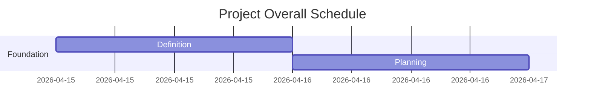

> [🏠 00_Master ] > [ 00_Master_Report ]

# 📊 Project Master Dashboard: {{プロジェクト名}}

## 📍 現在のプロジェクト・ステータス
- **現在のフェーズ**: Kickoff / Implementation
- **全体の達成率**: 0%

## 📈 進捗可視化 (Current Gantt Chart)

| Phase | Task ID | Task Name | Description | Status |
| :--- | :--- | :--- | :--- | :--- |
| Phase 1 | TSK-01 | {{タスク名}} | {{詳細}} | 0% |
| Phase 1 | TSK-02 | {{タスク名}} | {{詳細}} | 0% |

## 📝 直近の遂行サマリー
* {{最新の実行内容}}

---
## 📂 プロジェクト・ディレクトリ
| ID | フォルダ / ファイル | 役割 | ステータス |
| :--- | :--- | :--- | :--- |
| 01 | `01_Requirements/` | 要求と要件の定義 | ⏳ 待機中 |
| 02 | `02_Planning/` | WBSとスケジュール | ⏳ 待機中 |
| 03 | `03_Implementation/` | フェーズ別の遂行履歴とコード | ⏳ 待機中 |
| 04 | `04_Quality_Gate/` | 検証・テストエビデンス | ⏳ 待機中 |
| 05 | `05_Issue_Log/` | インシデント（バグ）カルテ | ⏳ 待機中 |
| 06 | `06_Delivery/` | 最終納品パッケージ | ⏳ 待機中 |
