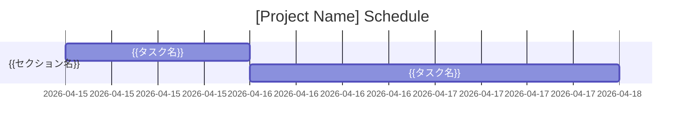

> [🏠 00_Master ] > [ 02_Planning ]

# 🗓️ Project Planning: WBS & Schedule

## 1. Work Breakdown Structure (WBS辞書)
VIS-004 基準に基づき定義されたタスク一覧です。

| Phase | Task ID | Task Name | Description | Status |
| :--- | :--- | :--- | :--- | :--- |
| {{フェーズ名}} | TSK-01 | {{タスク名}} | {{詳細説明}} | 0% |
| {{フェーズ名}} | TSK-02 | {{タスク名}} | {{詳細説明}} | 0% |

## 2. 📈 進捗可視化 (Current Gantt Chart)

