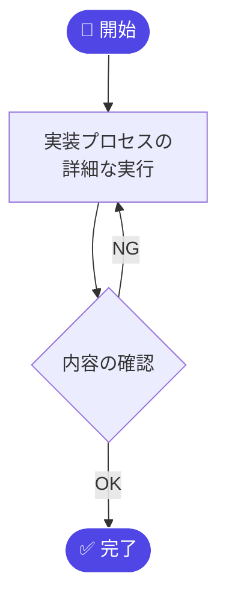
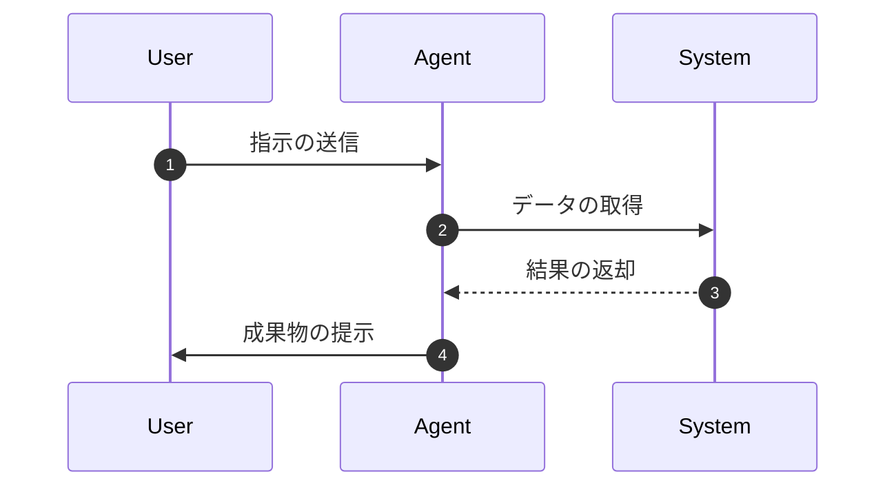

# 🎨 Mermaid Diagram Templates (v2.0)

このファイルは、プロジェクト内での可視化を一貫させるための Mermaid 標準テンプレートです。
VS Code プレビューとドキュメントポータルの両方でレンダリング可能な形式を採用しています。

## 1. 共通テーマ設定
ポータル上では自動的に適用されます。MDファイル内で個別に適用したい場合は以下を冒頭に含めます。
```mermaid
%%{init: {'theme': 'base', 'themeVariables': { 'primaryColor': '#4f46e5', 'primaryTextColor': '#fff' }}}%%
```

## 2. フローチャート (Flowchart)


## 3. ガントチャート (Gantt Chart)
```mermaid
gantt
    title プロジェクト・スケジュール
    dateFormat  YYYY-MM-DD
    axisFormat  %m/%d
    
    section フェーズ1
    タスクA :a1, 2026-04-01, 7d
    タスクB :after a1, 5d
    
    section フェーズ2
    タスクC :after a1, 10d

> [!TIP]
> **Aurora Ultra Gantt Engine 対応**: 
> 依存関係 (`after ID`) を正確に記述することで、ポータル上では自動的に Waterfall（階段状）ロジックが適用されます。また、全画面表示時には一画面フィット機能が動作します。
```

## 4. シーケンス図 (Sequence Diagram)

